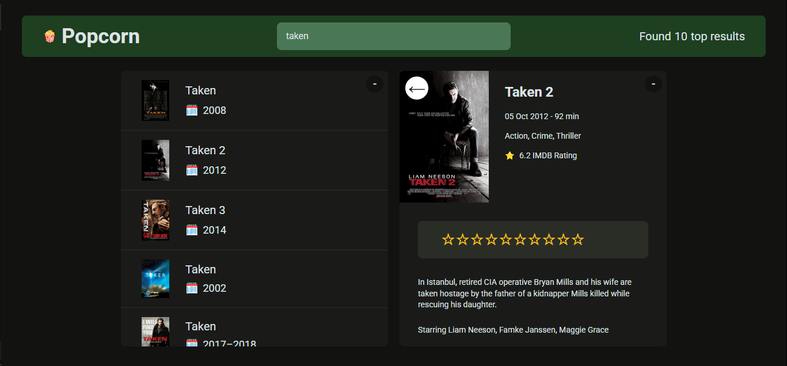

# 🍿 Popcorn - Movie Search Application

<p align="left"></p>

A vanilla JavaScript application for searching and managing your watched movies. Built with pure JavaScript, HTML, and CSS, featuring a modern UI with Tailwind CSS.

## 🌟 Features

- Search for movies using OMDB API
- View detailed information about each movie including:
  - Title, Year, Runtime
  - IMDB Rating
  - Plot summary
  - Director and Actors
  - Genre
- Rate movies with a 1-10 star rating system
- Add movies to your watched list
- Track your watched movies with statistics:
  - Average IMDB rating
  - Average user rating
  - Average runtime
  - Total movies watched
- Responsive and modern UI with Tailwind CSS
- Persistent storage using localStorage
- Keyboard shortcuts:
  - `Esc` to close movie details
  - `Enter` to focus search box

## 🚀 Getting Started

### Prerequisites

- Node.js (latest stable version)
- npm or yarn
- A modern web browser

### Installation

1. Clone the repository:

```bash
git clone [your-repo-url]
```

2. Navigate to the project directory:

```bash
cd popcorn
```

3. Install dependencies:

```bash
npm install
```

4. Start the development server:

```bash
npm run dev
```

5. For Tailwind CSS compilation:

```bash
npm run tailwind
```

## 🎮 How to Use

1. **Search Movies**:

   - Type at least 3 characters in the search box
   - Results will update automatically

2. **View Movie Details**:

   - Click on any movie from the search results
   - View comprehensive movie information

3. **Rate & Add Movies**:

   - Click on the stars to rate (1-10)
   - Click "Add to list" to add to watched movies

4. **Manage Watched Movies**:

   - View your watched movies list
   - Remove movies using the "X" button
   - See statistics in the summary section

5. **Toggle Sections**:
   - Use "-/+" buttons to collapse/expand sections

## 🛠️ Technical Stack

- Vanilla JavaScript (ES6+)
- HTML5
- Tailwind CSS v4.0.9
- Vite v6.2.0 (Build tool)
- OMDB API for movie data

## 📦 Dependencies

```json
{
  "@tailwindcss/cli": "^4.0.9",
  "tailwindcss": "^4.0.9"
}
```

## 🔑 API Configuration

The application uses the OMDB API. The API key is already configured in the application.

## 💻 Development

To run the project in development mode with hot reload:

```bash
npm run dev
```

To compile Tailwind CSS:

```bash
npm run tailwind
```

To build for production:

```bash
npm run build
```

## 🌐 Browser Support

- Chrome (latest)
- Firefox (latest)
- Safari (latest)
- Edge (latest)

## 📝 License

MIT License

## 🤝 Contributing

Contributions are welcome! Please feel free to submit a Pull Request.
